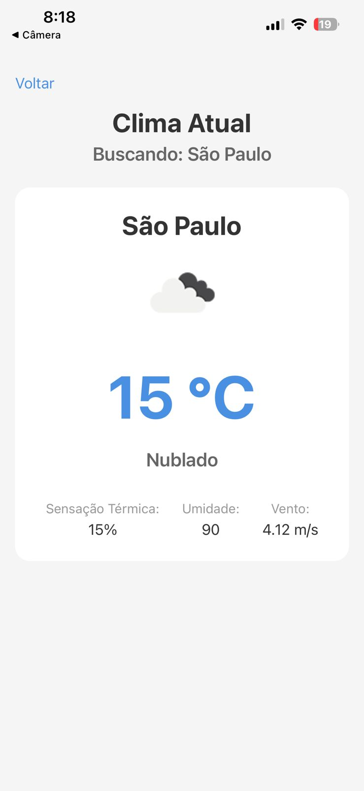

# 🌤️ Climora

Aplicativo mobile de previsão do tempo desenvolvido com React Native, Expo e TypeScript, utilizando a API pública da OpenWeather para buscar informações climáticas em tempo real.

## 📱 Demonstração

<div align="center">
  
  
  
</div>

## ✨ Funcionalidades

- Buscar clima de qualquer cidade
- Exibir temperatura atual
- Mostrar descrição do clima
- Informações de umidade e velocidade do vento
- Interface moderna e responsiva
- Navegação entre telas
- Integração com API pública
- Estrutura organizada e escalável

## 🚀 Tecnologias utilizadas

- React Native
- Expo
- TypeScript
- Expo Router
- OpenWeather API
- React Native Safe Area Context

## 📂 Estrutura do projeto

```txt
climora
├── assets
│   └── images
├── src
│   ├── app
│   │   ├── _layout.tsx
│   │   ├── details.tsx
│   │   └── index.tsx
│   │
│   ├── components
│   │   ├── SearchBar.tsx
│   │   └── WeatherCard.tsx
│   │
│   ├── hooks
│   │   └── useLocation.ts
│   │
│   ├── services
│   │   └── weatherService.ts
│   │
│   ├── styles
│   │   ├── colors.ts
│   │   ├── details.styles.ts
│   │   ├── home.styles.ts
│   │   ├── searchBar.styles.ts
│   │   └── weatherCard.styles.ts
│   │
│   └── types
│       └── weather.ts
│
├── .env.example
├── app.json
├── babel.config.js
├── package.json
└── tsconfig.json
```

## 🌎 API utilizada

- OpenWeather API
